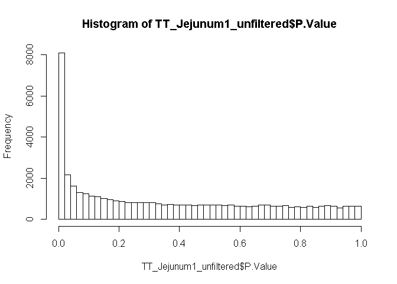
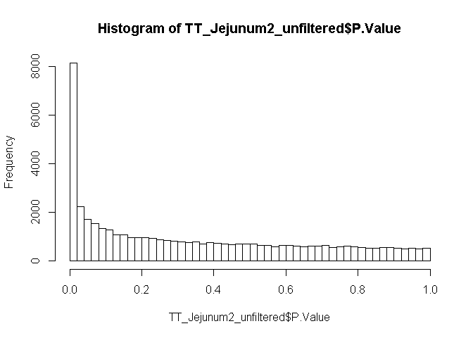

# Exploration of different models for tissue specific gene expression

The tissues selected for analysis were the jejunum, blood, tonsil, axillary lymph node, mesenteric lymph node, genital pelvic lymph node, and colon because each had at least 3 biological replicates for all of the time points. Therefore we need to fit a linear model for each tissue type to identify tissue specific differentially expressed genes. 


```r
## Load cleaned data and metadata
DATA <- read.table("../team_SIV-in-Rhesus-Monkeys/Data/Processed Data/DATA.txt", 
    header = TRUE, row.names = 1)
colnames(DATA) <- gsub("X", "", colnames(DATA))
MetaData <- read.table("../team_SIV-in-Rhesus-Monkeys/Data/Processed Data/MetaData_cleaned.txt", 
    header = TRUE, row.names = 1)
## Subsetting the metadata file for each tissue of interest
## and sorting each subset metadata by day
MetaData_Jejunum <- subset(MetaData, MetaData$tissue == "Jejunum")
MetaData_Jejunum <- MetaData_Jejunum[with(MetaData_Jejunum, order(days)), 
    ]
```
Now that we have our subset data frame for the Jejunum we can fit our linear model.

```r
## Design a matrix considering the variable time
Design_Jejunum1 <- model.matrix(~days, data = MetaData_Jejunum)
## Subset the total data with all of the Jejunum samples to
## match the matrix
DATA_Jejunum <- DATA[, c(row.names(MetaData_Jejunum))]
## Fit the data to the desgn matrix
Model_Jejunum1 <- eBayes(lmFit(DATA_Jejunum, Design_Jejunum1))
## Get the toptable
TT_Jejunum1_unfiltered <- topTable(Model_Jejunum1, coef = 2, 
    n = Inf)
## Filter the toptable by the adjusted p-value threshold
## chosen
TT_Jejunum1 <- (TT_Jejunum1_unfiltered %>% filter(adj.P.Val <= 
    0.05))
```
This above model is the most simple, but it may not be the best fit to the data. What if we include a quadratic with days?  

```r
# Include days^2 to see if a non-linear model better fits the
# data
Design_Jejunum2 <- model.matrix(~days + I(days^2), data = MetaData_Jejunum)
Model_Jejunum2 <- eBayes(lmFit(DATA_Jejunum, Design_Jejunum2))
TT_Jejunum2_unfiltered <- topTable(Model_Jejunum2, coef = 2:3, 
    n = Inf)
TT_Jejunum2_unfiltered$probe.id <- row.names(TT_Jejunum2_unfiltered)
TT_Jejunum2 <- (TT_Jejunum2_unfiltered %>% filter(adj.P.Val <= 
    0.05))
```
What is the difference between these models? How many probes are found to be differentially expressed in each?

```r
nrow(TT_Jejunum1)
```

```
## [1] 5598
```

```r
nrow(TT_Jejunum2)
```

```
## [1] 5463
```

```r
# What does the distruction of the adj.P.Val and P.Value look
# like?
hist(TT_Jejunum1_unfiltered$P.Value, breaks = 50)
```

<!-- -->

```r
hist(TT_Jejunum2_unfiltered$P.Value, breaks = 50)
```

<!-- -->

There is a big difference between the number of significant hits between these models. We will need to investigate further to determine which model best fits the data.  

These models (and the models shown below) are ready to enter into the validation stage, where we will determine which model best fits the data for downstream analysis. 

## Blood: 

```r
MetaData_Blood <- subset(MetaData, MetaData$tissue == "Blood")
MetaData_Blood <- MetaData_Blood[with(MetaData_Blood, order(days)), 
    ]
Design_Blood1 <- model.matrix(~days, data = MetaData_Blood)
DATA_Blood <- DATA[, c(row.names(MetaData_Blood))]
Model_Blood1 <- eBayes(lmFit(DATA_Blood, Design_Blood1))
TT_Blood1 <- topTable(Model_Blood1, coef = 2, n = Inf)
TT_Blood1 <- (TT_Blood1 %>% filter(adj.P.Val <= 0.05))

Design_Blood2 <- model.matrix(~days + I(days^2), data = MetaData_Blood)
Model_Blood2 <- eBayes(lmFit(DATA_Blood, Design_Blood2))
TT_Blood2 <- topTable(Model_Blood2, coef = 2:3, n = Inf)
TT_Blood2 <- (TT_Blood2 %>% filter(adj.P.Val <= 0.05))

nrow(TT_Blood1)
```

```
## [1] 1756
```

```r
nrow(TT_Blood2)
```

```
## [1] 4103
```

## Tonsil: 

```r
MetaData_Tonsil <- subset(MetaData, MetaData$tissue == "Tonsil")
MetaData_Tonsil <- MetaData_Tonsil[with(MetaData_Tonsil, order(days)), 
    ]
Design_Tonsil1 <- model.matrix(~days, data = MetaData_Tonsil)
DATA_Tonsil <- DATA[, c(row.names(MetaData_Tonsil))]
Model_Tonsil1 <- eBayes(lmFit(DATA_Tonsil, Design_Tonsil1))
TT_Tonsil1 <- topTable(Model_Tonsil1, coef = 2, n = Inf)
TT_Tonsil1 <- (TT_Tonsil1 %>% filter(adj.P.Val <= 0.05))

Design_Tonsil2 <- model.matrix(~days + I(days^2), data = MetaData_Tonsil)
Model_Tonsil2 <- eBayes(lmFit(DATA_Tonsil, Design_Tonsil2))
TT_Tonsil2 <- topTable(Model_Tonsil2, coef = 2:3, n = Inf)
TT_Tonsil2 <- (TT_Tonsil2 %>% filter(adj.P.Val <= 0.05))

nrow(TT_Tonsil1)
```

```
## [1] 100
```

```r
nrow(TT_Tonsil2)
```

```
## [1] 316
```

## Axillary Lymph Node: 

```r
MetaData_ALN <- subset(MetaData, MetaData$tissue == "axillary_LN")
MetaData_ALN <- MetaData_ALN[with(MetaData_ALN, order(days)), 
    ]
Design_ALN1 <- model.matrix(~days, data = MetaData_ALN)
DATA_ALN <- DATA[, c(row.names(MetaData_ALN))]
Model_ALN1 <- eBayes(lmFit(DATA_ALN, Design_ALN1))
TT_ALN1 <- topTable(Model_ALN1, coef = 2, n = Inf)
TT_ALN1 <- (TT_ALN1 %>% filter(adj.P.Val <= 0.05))

Design_ALN2 <- model.matrix(~days + I(days^2), data = MetaData_ALN)
Model_ALN2 <- eBayes(lmFit(DATA_ALN, Design_ALN2))
TT_ALN2 <- topTable(Model_ALN2, coef = 2:3, n = Inf)
TT_ALN2 <- (TT_ALN2 %>% filter(adj.P.Val <= 0.05))

nrow(TT_ALN1)
```

```
## [1] 1858
```

```r
nrow(TT_ALN2)
```

```
## [1] 2561
```

## Mesenteric Lymph Node: 

```r
MetaData_MLN <- subset(MetaData, MetaData$tissue == "mesenteric_LN")
MetaData_MLN <- MetaData_MLN[with(MetaData_MLN, order(days)), 
    ]
Design_MLN1 <- model.matrix(~days, data = MetaData_MLN)
DATA_MLN <- DATA[, c(row.names(MetaData_MLN))]
Model_MLN1 <- eBayes(lmFit(DATA_MLN, Design_MLN1))
TT_MLN1 <- topTable(Model_MLN1, coef = 2, n = Inf)
TT_MLN1 <- (TT_MLN1 %>% filter(adj.P.Val <= 0.05))

Design_MLN2 <- model.matrix(~days + I(days^2), data = MetaData_MLN)
Model_MLN2 <- eBayes(lmFit(DATA_MLN, Design_MLN2))
TT_MLN2 <- topTable(Model_MLN2, coef = 2:3, n = Inf)
TT_MLN2 <- (TT_MLN2 %>% filter(adj.P.Val <= 0.05))

nrow(TT_MLN1)
```

```
## [1] 1666
```

```r
nrow(TT_MLN2)
```

```
## [1] 2063
```

## Genital Pelvic Lymph Node: 

```r
MetaData_GLN <- subset(MetaData, MetaData$tissue == "genital_pelvic_LN")
MetaData_GLN <- MetaData_GLN[with(MetaData_GLN, order(days)), 
    ]
Design_GLN1 <- model.matrix(~days, data = MetaData_GLN)
DATA_GLN <- DATA[, c(row.names(MetaData_GLN))]
Model_GLN1 <- eBayes(lmFit(DATA_GLN, Design_GLN1))
TT_GLN1 <- topTable(Model_GLN1, coef = 2, n = Inf)
TT_GLN1 <- (TT_GLN1 %>% filter(adj.P.Val <= 0.05))

Design_GLN2 <- model.matrix(~days + I(days^2), data = MetaData_GLN)
Model_GLN2 <- eBayes(lmFit(DATA_GLN, Design_GLN2))
TT_GLN2 <- topTable(Model_GLN2, coef = 2:3, n = Inf)
TT_GLN2 <- (TT_GLN2 %>% filter(adj.P.Val <= 0.05))

nrow(TT_GLN1)
```

```
## [1] 1245
```

```r
nrow(TT_GLN2)
```

```
## [1] 1886
```

## Colon: 

```r
MetaData_Colon <- subset(MetaData, MetaData$tissue == "Colon")
MetaData_Colon <- MetaData_Colon[with(MetaData_Colon, order(days)), 
    ]
Design_Colon1 <- model.matrix(~days, data = MetaData_Colon)
DATA_Colon <- DATA[, c(row.names(MetaData_Colon))]
Model_Colon1 <- eBayes(lmFit(DATA_Colon, Design_Colon1))
TT_Colon1 <- topTable(Model_Colon1, coef = 2, n = Inf)
TT_Colon1 <- (TT_Colon1 %>% filter(adj.P.Val <= 0.05))

Design_Colon2 <- model.matrix(~days + I(days^2), data = MetaData_Colon)
Model_Colon2 <- eBayes(lmFit(DATA_Colon, Design_Colon2))
TT_Colon2 <- topTable(Model_Colon2, coef = 2:3, n = Inf)
TT_Colon2 <- (TT_Colon2 %>% filter(adj.P.Val <= 0.05))

nrow(TT_Colon1)
```

```
## [1] 132
```

```r
nrow(TT_Colon2)
```

```
## [1] 595
```
