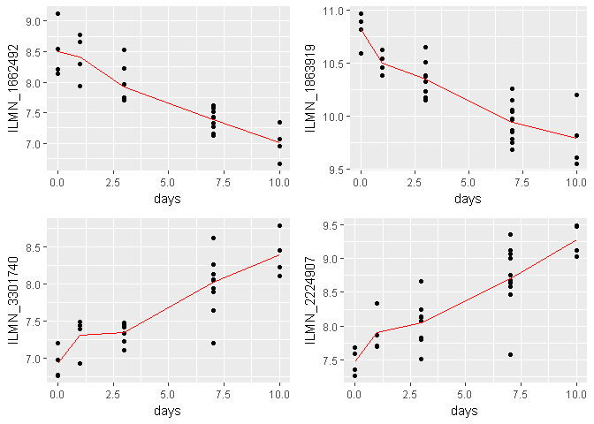

# Validation of linear models


First, we will import the cleaned data and meta data:

```r
DATA <- read.table("../team_SIV-in-Rhesus-Monkeys/Data/Processed Data/DATA.txt", 
    header = TRUE, row.names = 1)
colnames(DATA) <- gsub("X", "", colnames(DATA))
MetaData <- read.table("../team_SIV-in-Rhesus-Monkeys/Data/Processed Data/MetaData_cleaned.txt", 
    header = TRUE, row.names = 1)
```

We will replicate some steps from the linear model fitting. Subset the metadata file for each tissue of interest and sort each metadata frame by day. We will start with the jejunum and repeat the analysis for the other tissues.

```r
MetaData_Jejunum <- subset(MetaData, MetaData$tissue == "Jejunum")
MetaData_Jejunum <- MetaData_Jejunum[with(MetaData_Jejunum, order(days)), 
    ]
# Subset the total data with all of the Jejunum samples to
# match the matrix:
DATA_Jejunum <- DATA[, c(row.names(MetaData_Jejunum))]

# linear model with and without quadratic term:
Design_Jejunum1 <- model.matrix(~days, data = MetaData_Jejunum)
Model_Jejunum1 <- eBayes(lmFit(DATA_Jejunum, Design_Jejunum1), 
    robust = TRUE)
TT_Jejunum1 <- topTable(Model_Jejunum1, coef = 2, n = 4)
kable(TT_Jejunum1, format = "markdown")
```


|             |      logFC|   AveExpr|          t| P.Value| adj.P.Val|        B|
|:------------|----------:|---------:|----------:|-------:|---------:|--------:|
|ILMN_1662492 | -0.1517019|  7.751457| -10.101945|       0|   1.3e-06| 15.50558|
|ILMN_1863919 | -0.0983172| 10.210930|  -9.726821|       0|   1.3e-06| 14.78051|
|ILMN_3301740 |  0.1427727|  7.665288|   9.061074|       0|   5.6e-06| 12.94369|
|ILMN_1907326 |  0.1104934|  7.924274|   8.675704|       0|   9.2e-06| 12.02370|

```r
Design_Jejunum2 <- model.matrix(~days + I(days^2), data = MetaData_Jejunum)
Model_Jejunum2 <- eBayes(lmFit(DATA_Jejunum, Design_Jejunum2), 
    robust = TRUE)
TT_Jejunum2 <- topTable(Model_Jejunum2, coef = 2:3, n = 4)
kable(TT_Jejunum2, format = "markdown")
```


|             |       days| I.days.2.|   AveExpr|        F| P.Value| adj.P.Val|
|:------------|----------:|---------:|---------:|--------:|-------:|---------:|
|ILMN_3296372 | -0.0778546| 0.0253267|  7.589136| 56.48752|       0|   3.0e-06|
|ILMN_1863919 | -0.1626321| 0.0066739| 10.210930| 53.05600|       0|   3.0e-06|
|ILMN_1662492 | -0.2035372| 0.0053789|  7.751457| 51.50166|       0|   3.1e-06|
|ILMN_3248685 | -0.0874632| 0.0245816|  7.641700| 50.84442|       0|   3.1e-06|

Combine data with metadata (specifically for jejunum).

```r
annotdata <- cbind(t(DATA_Jejunum), MetaData_Jejunum)
```

## Plot top genes for the Jejunum
Plot the top four probes identified by the simple linear model

```r
l1 <- ggplot(annotdata, aes(x = days, y = ILMN_1662492)) + geom_point() + 
    stat_summary(fun.y = mean, colour = "red", geom = "line")
l2 <- ggplot(annotdata, aes(x = days, y = ILMN_1863919)) + geom_point() + 
    stat_summary(fun.y = mean, colour = "red", geom = "line")
l3 <- ggplot(annotdata, aes(x = days, y = ILMN_3301740)) + geom_point() + 
    stat_summary(fun.y = mean, colour = "red", geom = "line")
l4 <- ggplot(annotdata, aes(x = days, y = ILMN_2224907)) + geom_point() + 
    stat_summary(fun.y = mean, colour = "red", geom = "line")
grid.arrange(l1, l2, l3, l4, ncol = 2)
```

<!-- -->

Plot the top four probes identified by the linear model with the quadratic term

```r
q1 <- ggplot(annotdata, aes(x = days, y = ILMN_2068991)) + geom_point() + 
    stat_summary(fun.y = mean, colour = "red", geom = "line")
q2 <- ggplot(annotdata, aes(x = days, y = ILMN_1713247)) + geom_point() + 
    stat_summary(fun.y = mean, colour = "red", geom = "line")
q3 <- ggplot(annotdata, aes(x = days, y = ILMN_1797660)) + geom_point() + 
    stat_summary(fun.y = mean, colour = "red", geom = "line")
q4 <- ggplot(annotdata, aes(x = days, y = ILMN_2410194)) + geom_point() + 
    stat_summary(fun.y = mean, colour = "red", geom = "line")
grid.arrange(q1, q2, q3, q4, ncol = 2)
```

<!-- -->

There seem to be some probes for which the simple linear model is a very good estimate. However, there are also probes which seem to be better modeled by a model including a quadratic term.

## Model Selection
It might be better to determine for each probe, whether the linear or the quadratic model should be applied. To do this, we will use the function selectModel from the limma package. This function selects "the best fitting linear model for each gene by minimizing an information criterion". As criterion, we will use the Akaike's Information Criterion (AIC).

## Jejunum
We will write the following code as function, so we can re-use it for all the tissues. First, we need to create a list of the design matrices to be compared. Then, we will input those into the selectModel function which is built-in in limma:


```r
# write a function that will compare the linear to the
# quadratic model for a tissue of interest
sel.model <- function(x) {
    MD.tissue <- subset(MetaData, MetaData$tissue == x)  #subset metadata by tissue of interest
    D.tissue <- DATA[, c(row.names(MD.tissue))]  #subset data by samples from tissue of interest
    linear <- model.matrix(~days, data = MD.tissue)  #linear design matrix
    quadratic <- model.matrix(~days + I(days^2), data = MD.tissue)  #quadratic design matrix
    design.list <- list(linear, quadratic)  #combine linear and quadratic model in a list
    sel.model <- selectModel(D.tissue, design.list, criterion = "aic")  #apply the 'selectModel' function from limma
    return(sel.model)
}
```
The selectModel function from limma returns a list with two components. We will first look at the "pref" component which indicates the model with the lowest AIC score.


```r
sel.model.table <- function(x) {
    sel.model <- sel.model(x)  #use above written function to apply selectModel
    table <- table(sel.model$pref)  #extract the 'pref' component and present as table
    return(table)
}
```

Apply this function to the jejunum:

```r
sel.model.table("Jejunum")
```

```
## 
##     1     2 
## 34071 12957
```
For the jejunum, the simple linear model is a better fit for 34071 probes. The quadratic model is a better fit for only 12957 probes.

## Model selection for the other tissues:

```r
# define the tissues of interest
tissues_of_interest <- c("Jejunum", "Blood", "Tonsil", "axillary_LN", 
    "mesenteric_LN", "genital_pelvic_LN", "Colon")

# apply above written function to all tissues of interest
model.selection <- as.data.frame(sapply(as.list(tissues_of_interest), 
    sel.model.table))

# modify row and column names
colnames(model.selection) <- tissues_of_interest
rownames(model.selection) <- c("linear", "quadratic")
kable(model.selection, format = "markdown")
```


|          | Jejunum| Blood| Tonsil| axillary_LN| mesenteric_LN| genital_pelvic_LN| Colon|
|:---------|-------:|-----:|------:|-----------:|-------------:|-----------------:|-----:|
|linear    |   34071| 31426|  32653|       34115|         34856|             34003| 31443|
|quadratic |   12957| 15602|  14375|       12913|         12172|             13025| 15585|

In conclusion, the simple linear model is a better linear fit than the quadratic model for about two thirds of the probes in every tissue. However, there is a significant proportion of probes that are better described by a model including a quadratic term.

## By how much is the linear model better than the quadratic and vice versa?
By only looking at the "pref" component from the seletModel function, we can tell which model has a lower AIC but we can't see by how much the AIC is lower. When the difference in AIC between linear and quadratic model is small, there might not be an advantage of using one over the other model. We will now therefore look directly at the AIC for each model and probe. 

We will again start with the jejunum and then apply the same analysis to the other six tissues.

```r
# extract the information criterion from the select model
# function
sel.model.jejunum <- sel.model("Jejunum")
IC <- as.data.frame(sel.model.jejunum$IC)
kable(head(IC), format = "markdown")
```


|             |          1|          2|
|:------------|----------:|----------:|
|ILMN_1802380 |  -70.94420|  -71.59340|
|ILMN_1893287 | -148.43152| -146.45485|
|ILMN_3238331 | -135.22669| -133.53517|
|ILMN_1736104 | -138.60497| -136.74974|
|ILMN_1792389 |  -91.27105|  -89.27666|
|ILMN_1854015 |  -89.15669|  -87.16709|

The AIC values between the linear model and the quadratic model look very similar for the first probes. We will calculate the difference between the two AICs and add it as a new column to the data frame.


```r
IC$dif <- (sel.model.jejunum$IC[, "1"] - sel.model.jejunum$IC[, 
    "2"])
# modify column names:
colnames(IC) <- c("linear", "quadratic", "linear-quadratic")
kable(head(IC), format = "markdown")
```


|             |     linear|  quadratic| linear-quadratic|
|:------------|----------:|----------:|----------------:|
|ILMN_1802380 |  -70.94420|  -71.59340|        0.6492041|
|ILMN_1893287 | -148.43152| -146.45485|       -1.9766726|
|ILMN_3238331 | -135.22669| -133.53517|       -1.6915192|
|ILMN_1736104 | -138.60497| -136.74974|       -1.8552236|
|ILMN_1792389 |  -91.27105|  -89.27666|       -1.9943951|
|ILMN_1854015 |  -89.15669|  -87.16709|       -1.9895982|

Illustrate that the difference in meaningful by displaying "IC" for the top four hits of both models (the ones plotted in the beginning of this file):

```r
kable(IC[rownames(TT_Jejunum1[1:4, ]), ], format = "markdown")  #simple linear model
```


|             |    linear|  quadratic| linear-quadratic|
|:------------|---------:|----------:|----------------:|
|ILMN_1662492 | -74.45421|  -73.46080|       -0.9934044|
|ILMN_1863919 | -98.82289| -100.36415|        1.5412623|
|ILMN_3301740 | -71.49220|  -69.49227|       -1.9999278|
|ILMN_1907326 | -84.58595|  -83.67532|       -0.9106325|

```r
kable(IC[rownames(TT_Jejunum2[1:4, ]), ], format = "markdown")  #quadratic model
```


|             |    linear|  quadratic| linear-quadratic|
|:------------|---------:|----------:|----------------:|
|ILMN_3296372 | -53.87260|  -65.93419|       12.0615887|
|ILMN_1863919 | -98.82289| -100.36415|        1.5412623|
|ILMN_1662492 | -74.45421|  -73.46080|       -0.9934044|
|ILMN_3248685 | -56.19340|  -68.52776|       12.3343596|

Illustrate further by plotting the expression of the probes with the highest and lowest AIC difference:

```r
# extract the name of the probe with the lowest AIC
rownames(IC[IC$`linear-quadratic` == min(IC$`linear-quadratic`), 
    ])
```

```
## [1] "ILMN_3228470"
```

```r
# store plot of this probe as 'l'
l <- ggplot(annotdata, aes(x = days, y = ILMN_3228470)) + geom_point() + 
    stat_summary(fun.y = mean, colour = "red", geom = "line") + 
    ggtitle("lowest AIC difference")

# extract the name of the probe with the highest AIC
rownames(IC[IC$`linear-quadratic` == max(IC$`linear-quadratic`), 
    ])
```

```
## [1] "ILMN_1713247"
```

```r
# plot this probe of this probe as 'h'
h <- ggplot(annotdata, aes(x = days, y = ILMN_1713247)) + geom_point() + 
    stat_summary(fun.y = mean, colour = "red", geom = "line") + 
    ggtitle("highest AIC difference")

# combine the two plots in one graph
grid.arrange(l, h, ncol = 2)
```

<!-- -->

We can see that the gene expression for the probe with the lowest AIC is not well characterized by neither the linear nor the quadratic model whereas the quadratic model characterizes very well the gene expression for the probe with the highest AIC values. 

What is the range and distribution of the AIC differences?

```r
# look at the range of AIC differences
summary(IC$`linear-quadratic`)
```

```
##    Min. 1st Qu.  Median    Mean 3rd Qu.    Max. 
## -2.0000 -1.8250 -1.2320 -0.3246  0.2119 30.2300
```

```r
# histogram of AIC difference distribution
histogram(IC$`linear-quadratic`, breaks = 50, xlab = "difference in AIC between linear and quadratic model", 
    main = "Jejunum")
```

<!-- -->

Calculate percentage of probes for which the difference between the two AICs is between 2 and -2:

```r
100 * sum(IC$`linear-quadratic` <= 2 & IC$`linear-quadratic` >= 
    -2)/nrow(IC)
```

```
## [1] 87.73071
```

A negative difference between the two AICs means that the linear model is a better fit; a positive difference indicates that the quadratic model is a better fit. The high percentage (87.7%) of probes for which the difference between the two AICs is between 2 and -2 indicates that there is no big advantage of choosing one model over the other. Considering that the quadratic model includes a linear term, we will not loose any information when using the quadratic model. Since there are no probes for which the linear model is significantly better but several probes for which the quadratic model is much better (AIC difference of up to 35), we decide to use the quadratic model in all our (downstream) analyses.

We will now repeat this analysis for the other tissues to determine if the quadratic model should be chosen for all of them:

Write a function that can be applied to each of the tissues and will extract the IC component from the selectModel object:

```r
AIC.comp <- function(x) {
    sm <- sel.model(x)  #apply above written sel.model function to tissue of interest
    IC <- as.data.frame(sm$IC)  #extract IC component
    IC$dif <- (sm$IC[, "1"] - sm$IC[, "2"])  #calculate difference btw AICs and add as new column
    colnames(IC) <- c("linear", "quadratic", "linear-quadratic")  #rename columns
    return(IC)
}
```

Function for the AIC comparison summary:

```r
AIC.comp.summary <- function(x) {
    aic <- AIC.comp(x)  #apply above written function to extract the AICs
    table <- summary(aic$"linear-quadratic")  #view summary of AIC difference range
    return(table)
}
```

Function for the percentage of probes with AICs between 2 and -2:

```r
AIC.perc <- function(x) {
    aic <- AIC.comp(x)  #apply above written function to extract the AICs
    percentage <- 100 * sum(aic$`linear-quadratic` <= 2 & aic$`linear-quadratic` >= 
        -2)/nrow(aic)  #calculate percentage of AICs difference between 2 and -2
    return(percentage)
}
```

Apply summary function to tissues of interest and combine results in a table to view the range of AIC value distribution in each tissue:

```r
AIC.comparison <- as.data.frame(sapply(as.list(tissues_of_interest), 
    AIC.comp.summary))
# adjust column names
colnames(AIC.comparison) <- tissues_of_interest

# apply percentage function to tissues of interest
AIC.percentage <- as.data.frame(sapply(as.list(tissues_of_interest), 
    AIC.perc))
# adjust row and columnnames
rownames(AIC.percentage) <- tissues_of_interest
colnames(AIC.percentage) <- "% of -2<=AIC.diff<=2"

# combine the two tables
AIC.comparison.table <- rbind(AIC.comparison, t(AIC.percentage))
kable(AIC.comparison.table, format = "markdown", digits = 2, 
    caption = "Summary of 'AIC linear - AIC quadratic' for all probes in each tissue")
```


|                     | Jejunum| Blood| Tonsil| axillary_LN| mesenteric_LN| genital_pelvic_LN| Colon|
|:--------------------|-------:|-----:|------:|-----------:|-------------:|-----------------:|-----:|
|Min.                 |   -2.00| -2.00|  -2.00|       -2.00|         -2.00|             -2.00| -2.00|
|1st Qu.              |   -1.82| -1.79|  -1.80|       -1.84|         -1.84|             -1.83| -1.78|
|Median               |   -1.23| -1.05|  -1.12|       -1.25|         -1.29|             -1.24| -1.02|
|Mean                 |   -0.32|  0.29|  -0.14|       -0.23|         -0.39|             -0.28|  0.00|
|3rd Qu.              |    0.21|  0.82|   0.51|        0.22|          0.08|              0.24|  0.81|
|Max.                 |   30.23| 35.89|  27.54|       34.54|         32.96|             28.10| 24.68|
|% of -2<=AIC.diff<=2 |   87.73| 82.36|  85.49|       87.09|         88.69|             87.29| 83.42|

Plot the distribution of AIC difference for all tissues:

```r
# write plotting function
AIC.hist <- function(x) {
    aic <- AIC.comp(x)
    h <- histogram(aic$`linear-quadratic`, breaks = 50, xlab = "AIC dif. btw t and t^2 model", 
        main = x, xlim = c(-3, 36), ylim = c(0, 60))
    return(h)
}

# apply the plotting function of all tissues of interest
grid.arrange(AIC.hist("Blood"), AIC.hist("Tonsil"), AIC.hist("axillary_LN"), 
    AIC.hist("mesenteric_LN"), AIC.hist("genital_pelvic_LN"), 
    AIC.hist("Colon"), ncol = 3, name = "Summary of 'AIC linear - AIC quadratic' for all probes in each tissue")
```

<!-- -->

The range of AIC values is very similar between all seven tissues. The "clear" cutoff at -2 is due to the way that the AIC is calculated: AIC = 2k - 2ln(L) where k is the number of model parameters and L is the maximized value of the likelihood function for the evaluated model. A difference of -2 simply reflects the higher number of degrees of freedom in the quadratic model when there is no difference in L for the two models.

We detailed above, why the quadratic model is preferential for the Jejunum. As all other tissues show similar patterns, we will choose the quadratic model for all tissues of interest.
