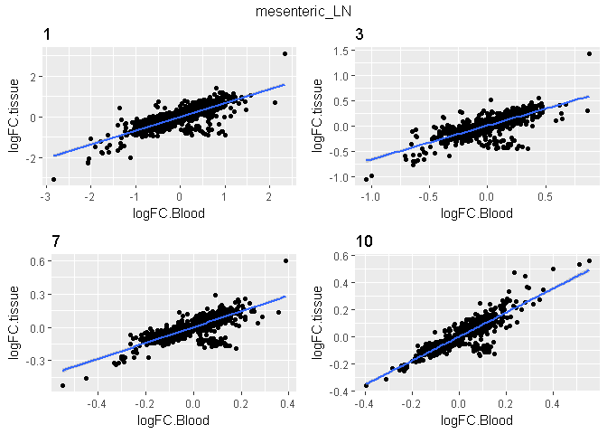

# Question 2: Are the transcriptomic changes in blood the same as in the other tissues after SIV infection?


From the linear models, we have obtained "hit lists" containing probes that are differentially expressed (DE) within each tissue. The number of DE probes is very different for the seven tissues. To first assess, whether there are some genes that are affected in all tissues, we will plot Venn Diagrams displaying the overlap in significantly DE probes. It is not possible, to plot all seven tissues into one single Venn Diagram, therefore, we create one plot comparing blood and the three different lymph nodes and another one comparing the colon, jejunum, tonsil and blood.


```r
venn.plot.blood.lymph <- venn.diagram(list(Blood = TT_Blood$probe.id, 
    `Mesenteric Lymph Node` = TT_MLN$probe.id, `Axillary Lymph Node` = TT_ALN$probe.id, 
    `Genital Pelvic Lymph Node` = TT_GLN$probe.id), filename = NULL, 
    fill = c("red", "blue", "yellow", "green"), main = "Overlap of DE probes", 
    cat.just = list(c(0.5, 0), c(0.7, -1), c(0.5, 0), c(0.5, 
        0)), main.fontface = 2, cat.fontface = 2, fontface = 2)
grid.newpage()
grid.draw(venn.plot.blood.lymph)
```

<!-- -->

```r
venn.plot.blood.nonlymph <- venn.diagram(list(Blood = TT_Blood$probe.id, 
    Colon = TT_Colon$probe.id, Tonsil = TT_Tonsil$probe.id, Jejunum = TT_Jejunum$probe.id), 
    filename = NULL, fill = c("red", "blue", "yellow", "green"), 
    main = "Overlap of DE probes", main.fontface = 2, cat.fontface = 2, 
    fontface = 2)
grid.newpage()
grid.draw(venn.plot.blood.nonlymph)
```

<!-- -->

We will now specifically compare blood versus the axillary lymph node. The same analysis will be repeated for the other tissue types afterward.


```r
# Venn Diagram comparing Blood vs Axillary LN
venn.plot.blood.ALN <- venn.diagram(list(Blood = TT_Blood$probe.id, 
    `Axillary Lymph Node` = TT_ALN$probe.id), filename = NULL, 
    fill = c("red", "yellow"), main = "Overlap of DE probes", 
    cat.just = list(c(-4.2, -4.8), c(1.4, -3.5)), main.fontface = 2, 
    cat.fontface = 2, fontface = 2)
grid.newpage()
grid.draw(venn.plot.blood.ALN)
```

<!-- -->

We are now interested in the 1343 probes that are DE in both the blood and the axillary LN. We will construct a dataframe showing expression levels for these 1343 probes in the samples from blood and axillary lymph node. The following code will be written as a function, so that it can be re-used for the other tissue comparisons.

Make a function to create a data frame with common DE probes and samples from blood and the tissue of interest:

```r
common.frame <- function(TT_t, tissue, Data_t) {
    # extract the probes that are DE in both Blood and ALN:
    common.blood.tissue <- intersect(TT_Blood$probe.id, TT_t$probe.id)
    # subset the meta data, keeping the samples from blood and
    # ALN:
    MetaData.Blood.tissue <- MetaData[MetaData$tissue == "Blood" | 
        MetaData$tissue == tissue, ]
    # make a dataframe with the probes that are DE for Blood and
    # ALN and the samples that come from these two tissues:
    DATA.blood.tissue <- cbind(DATA_Blood, Data_t)
    common.blood.tissue.frame <- DATA.blood.tissue[common.blood.tissue, 
        ]
    # add the meta data information:
    common.frame <- cbind(t(common.blood.tissue.frame), MetaData.Blood.tissue)
    return(common.frame)
}

# call function to compare the Axillary LN to Blood:
common.blood.aln.frame <- common.frame(TT_t = TT_ALN, tissue = "axillary_LN", 
    Data_t = DATA_ALN)

# plot a probe from this data frame:
ggplot(common.blood.aln.frame, aes(x = days, y = ILMN_1660723, 
    color = tissue)) + geom_point() + stat_summary(fun.y = mean, 
    geom = "line")
```

<!-- -->

We can see that the expression pattern for this probe is different in blood and axillary lymph node, however, expression gets upregulated in both tissues after SIV infection and then drops down by day ten. To more globally assess whether the expression patterns are different for all common DE probes, we will calculate fold changes in gene expression for each tissue and then plot them against each other. A strong correlation will indicate that genes are similarly affected independent of tissue.

### Blood vs Axillary LN: plot the fold changes against each other:
For each time point, we will make a linear model comparing the time point against day 0 (--> four linear models: day1vs0, day3vs0, day7vs0, day10vs0). This will be done for each tissue separately and only for the probes that are DE in both blood and the tissue of interest (here: ALN). The logFC will be extracted and then compared (by graphing) between the tissues. This analysis will tell us whether probes that are DE in both tissues are affected similarly in the two tissues (e.g. 3-fold up-regulated in both tissues).

The following code will again be stored in a function to be re-used for the other tissue comparisons.

Make linear model comparing day 0 to day 7 for tissue of interest:

```r
hits <- function(t, days) {
    # subset the meta data by the tissue of interest
    MetaData_tissue <- subset(MetaData, MetaData$tissue == t)
    # subset the meta data by day 0 and time point of interest
    MetaData_tissue.0vs7 <- MetaData_tissue[MetaData_tissue$days == 
        0 | MetaData_tissue$days == days, ]
    # subest the data by these samples
    DATA_tissue.0vs7 <- DATA[, c(row.names(MetaData_tissue.0vs7))]
    # fit a linear model comparing day 0 and day 7:
    Design_tissue.0vs7 <- model.matrix(~days, data = MetaData_tissue.0vs7)
    Model_tissue.0vs7 <- eBayes(lmFit(DATA_tissue.0vs7, Design_tissue.0vs7))
    TT <- topTable(Model_tissue.0vs7, coef = 2, n = Inf)
    return(TT)
}
```
Write function for selecting the DE probes common to blood and tissue of interest:

```r
hits.blood.vs <- function(TISSUE, TT_TISSUE, DAYS) {
    # use the above created function to fit a linear model and
    # make a toptable for the tissue of interest and one for
    # blood
    TT_tissue.0vs7 <- hits(t = TISSUE, days = DAYS)
    TT_Blood.0vs7 <- hits(t = "Blood", days = DAYS)
    # select those probes that are DE in both blood and ALN:
    common.blood.tissue <- intersect(TT_Blood$probe.id, TT_TISSUE$probe.id)
    # subset the toptables by these probes
    TT_tissue.0vs7 <- TT_tissue.0vs7[common.blood.tissue, ]
    TT_Blood.0vs7 <- TT_Blood.0vs7[common.blood.tissue, ]
    # combine the two data frames
    TT_Blood.0vs7$logFC.tissue <- TT_tissue.0vs7$logFC
    TT_Blood.0vs7 <- TT_Blood.0vs7[, c(1, 7)]
    colnames(TT_Blood.0vs7) <- c("logFC.Blood", "logFC.tissue")
    return(TT_Blood.0vs7)
}
```
Write function for plotting the fold changes against each other:

```r
plotFC <- function(Tissue, TT_Tissue, Day) {
    # use above created function to make a data frame containing
    # probes DE in blood and the tissue of interest, with the
    # fold change between day x and day 0 in both tissues
    hitframe <- hits.blood.vs(TISSUE = Tissue, TT_TISSUE = TT_Tissue, 
        DAYS = Day)
    # plot the fold changes in the two tissues against each other
    plot <- ggplot(hitframe, aes(x = logFC.Blood, y = logFC.tissue)) + 
        geom_point() + geom_smooth(method = lm) + ggtitle(Day)
    return(plot)
}
```
Function to combine above functions for all time points for one tissue versus blood:

```r
plotFC.all <- function(Tissue, TT_Tissue) {
    # use above created function to plot the fold change
    # comparison for all days
    plot1 <- plotFC(Tissue = Tissue, TT_Tissue = TT_Tissue, Day = 1)
    plot3 <- plotFC(Tissue = Tissue, TT_Tissue = TT_Tissue, Day = 3)
    plot7 <- plotFC(Tissue = Tissue, TT_Tissue = TT_Tissue, Day = 7)
    plot10 <- plotFC(Tissue = Tissue, TT_Tissue = TT_Tissue, 
        Day = 10)
    # combine the four plots into one graph
    plot.all <- grid.arrange(plot1, plot3, plot7, plot10, ncol = 2, 
        top = Tissue)
    return(plot.all)
}
```

Function to display summary of linear regression line:

```r
results.lm <- function(Tissue, TT_Tissue, Day) {
    hitframe <- hits.blood.vs(TISSUE = Tissue, TT_TISSUE = TT_Tissue, 
        DAYS = Day)
    lm <- lm(logFC.tissue ~ logFC.Blood, data = hitframe)  #calculate linear regression
    Intercept <- lm$coef[[1]]  #extract desired values
    Slope <- lm$coef[[2]]
    adj.R.squared <- summary(lm)$adj.r.squared
    results.lm <- data.frame(Intercept, Slope, adj.R.squared)  #combine in a data frame
    return(results.lm)
}
```
Function to display summary of linear regression for all time points:

```r
results.lm.all <- function(Tissue, TT_Tissue) {
    # use above created function to extract linear regression
    # summary for all days
    d1 <- results.lm(Tissue = Tissue, TT_Tissue = TT_Tissue, 
        Day = 1)
    d3 <- results.lm(Tissue = Tissue, TT_Tissue = TT_Tissue, 
        Day = 3)
    d7 <- results.lm(Tissue = Tissue, TT_Tissue = TT_Tissue, 
        Day = 7)
    d10 <- results.lm(Tissue = Tissue, TT_Tissue = TT_Tissue, 
        Day = 10)
    # combine the four frames into one table
    results.lm.all <- rbind(d1, d3, d7, d10)
    rownames(results.lm.all) <- c("day1.vs.0", "day3.vs.0", "day7.vs.0", 
        "day10.vs.0")
    return(results.lm.all)
}
```

Apply the functions to the axillary lymph node:

```r
# run the final plot function for the axillary LN:
plotFC.all(Tissue = "axillary_LN", TT_Tissue = TT_ALN)
```

<!-- -->

```
## TableGrob (3 x 2) "arrange": 5 grobs
##   z     cells    name                grob
## 1 1 (2-2,1-1) arrange      gtable[layout]
## 2 2 (2-2,2-2) arrange      gtable[layout]
## 3 3 (3-3,1-1) arrange      gtable[layout]
## 4 4 (3-3,2-2) arrange      gtable[layout]
## 5 5 (1-1,1-2) arrange text[GRID.text.322]
```

```r
# run the final linear regression summary function for the
# axillary LN:
kable(results.lm.all(Tissue = "axillary_LN", TT_Tissue = TT_ALN), 
    format = "markdown", digits = c(4, 2, 2))
```


|           | Intercept| Slope| adj.R.squared|
|:----------|---------:|-----:|-------------:|
|day1.vs.0  |    0.0682|  0.63|          0.69|
|day3.vs.0  |    0.0191|  0.61|          0.73|
|day7.vs.0  |    0.0083|  0.75|          0.82|
|day10.vs.0 |    0.0073|  0.84|          0.85|

The probes that are DE in both the blood and the axillary lymph node have a strong correlation in their fold changes, espeially at the later time points as indicated by high r squared values. The slope <1 indicates that probes that are upregulated in the blood are also upregulated in the axillary lymph node but to a lesser extent 

## Mesenteric LN

```r
# plot Venn diagram
venn.plot.blood.MLN <- venn.diagram(list(Blood = TT_Blood$probe.id, 
    `Mesenteric Lymph Node` = TT_MLN$probe.id), filename = NULL, 
    fill = c("red", "blue"), main = "Overlap of DE probes", cat.just = list(c(-4.2, 
        -4.6), c(1.2, -3)), main.fontface = 2, cat.fontface = 2, 
    fontface = 2)
grid.newpage()
grid.draw(venn.plot.blood.MLN)
```

<!-- -->

```r
# plot fold change comparison
plotFC.all(Tissue = "mesenteric_LN", TT_Tissue = TT_MLN)
```

<!-- -->

```
## TableGrob (3 x 2) "arrange": 5 grobs
##   z     cells    name                grob
## 1 1 (2-2,1-1) arrange      gtable[layout]
## 2 2 (2-2,2-2) arrange      gtable[layout]
## 3 3 (3-3,1-1) arrange      gtable[layout]
## 4 4 (3-3,2-2) arrange      gtable[layout]
## 5 5 (1-1,1-2) arrange text[GRID.text.529]
```

```r
# linear regression summary
kable(results.lm.all(Tissue = "mesenteric_LN", TT_Tissue = TT_MLN), 
    format = "markdown", digits = c(4, 2, 2))
```


|           | Intercept| Slope| adj.R.squared|
|:----------|---------:|-----:|-------------:|
|day1.vs.0  |    0.0131|  0.68|          0.64|
|day3.vs.0  |    0.0113|  0.67|          0.58|
|day7.vs.0  |    0.0009|  0.71|          0.66|
|day10.vs.0 |    0.0031|  0.89|          0.75|

For the mesenteric lymph node, the fold change correlation with blood is lower than for the axillary lymph node. The slope is again <1, indicating changes in the same direction but a weaker response in the lymph node than in the blood.

## Genital Pelvic Lymph Node

```r
# plot Venn diagram
venn.plot.blood.GLN <- venn.diagram(list(Blood = TT_Blood$probe.id, 
    `Genital Pelvic Lymph Node` = TT_GLN$probe.id), filename = NULL, 
    fill = c("red", "green"), main = "Overlap of DE probes", 
    cat.just = list(c(-4.2, -4.6), c(1.1, -3)), main.fontface = 2, 
    cat.fontface = 2, fontface = 2)
grid.newpage()
grid.draw(venn.plot.blood.GLN)
```

<!-- -->

```r
# plot fold change comparison
plotFC.all(Tissue = "genital_pelvic_LN", TT_Tissue = TT_GLN)
```

<!-- -->

```
## TableGrob (3 x 2) "arrange": 5 grobs
##   z     cells    name                grob
## 1 1 (2-2,1-1) arrange      gtable[layout]
## 2 2 (2-2,2-2) arrange      gtable[layout]
## 3 3 (3-3,1-1) arrange      gtable[layout]
## 4 4 (3-3,2-2) arrange      gtable[layout]
## 5 5 (1-1,1-2) arrange text[GRID.text.736]
```

```r
# linear regression summary
kable(results.lm.all(Tissue = "genital_pelvic_LN", TT_Tissue = TT_GLN), 
    format = "markdown", digits = c(4, 2, 2))
```


|           | Intercept| Slope| adj.R.squared|
|:----------|---------:|-----:|-------------:|
|day1.vs.0  |    0.0602|  0.67|          0.62|
|day3.vs.0  |    0.0217|  0.68|          0.60|
|day7.vs.0  |    0.0099|  0.77|          0.68|
|day10.vs.0 |    0.0089|  0.92|          0.77|

The results for the genital pelvic lymph node are very similar to that from the other two lymph nodes.

## Jejunum

```r
# plot Venn diagram
venn.plot.blood.Jejunum <- venn.diagram(list(Blood = TT_Blood$probe.id, 
    Jejunum = TT_Jejunum$probe.id), filename = NULL, fill = c("red", 
    "green"), main = "Overlap of DE probes", cat.just = list(c(4.8, 
    -23), c(-3, -25)), main.fontface = 2, cat.fontface = 2, fontface = 2)
grid.newpage()
grid.draw(venn.plot.blood.Jejunum)
```

<!-- -->

```r
# plot fold change comparison
plotFC.all(Tissue = "Jejunum", TT_Tissue = TT_Jejunum)
```

<!-- -->

```
## TableGrob (3 x 2) "arrange": 5 grobs
##   z     cells    name                grob
## 1 1 (2-2,1-1) arrange      gtable[layout]
## 2 2 (2-2,2-2) arrange      gtable[layout]
## 3 3 (3-3,1-1) arrange      gtable[layout]
## 4 4 (3-3,2-2) arrange      gtable[layout]
## 5 5 (1-1,1-2) arrange text[GRID.text.943]
```

```r
# linear regression summary
kable(results.lm.all(Tissue = "Jejunum", TT_Tissue = TT_Jejunum), 
    format = "markdown", digits = c(4, 2, 2))
```


|           | Intercept| Slope| adj.R.squared|
|:----------|---------:|-----:|-------------:|
|day1.vs.0  |    0.0090|  1.10|          0.57|
|day3.vs.0  |    0.0151|  0.92|          0.55|
|day7.vs.0  |    0.0039|  1.11|          0.63|
|day10.vs.0 |   -0.0085|  1.40|          0.68|

There is correlation between the fold changes in the jejunum and in the blood, although rather low. The slope around 1 indicates that genes are up- and down-regulated to the same extent in blood and jejunum after SIV infection. At day 10 (slope = 1.4), the changes in jejunum are more pronounced that in blood for the genes that are DE in both tissues.

## Colon

```r
# plot Venn diagram
venn.plot.blood.Colon <- venn.diagram(list(Blood = TT_Blood$probe.id, 
    Colon = TT_Colon$probe.id), filename = NULL, fill = c("red", 
    "blue"), main = "Overlap of DE probes", cat.just = list(c(-4.6, 
    -4.9), c(3, -2)), main.fontface = 2, cat.fontface = 2, fontface = 2)
grid.newpage()
grid.draw(venn.plot.blood.Colon)
```

<!-- -->

```r
# plot fold change comparison
plotFC.all(Tissue = "Colon", TT_Tissue = TT_Colon)
```

<!-- -->

```
## TableGrob (3 x 2) "arrange": 5 grobs
##   z     cells    name                 grob
## 1 1 (2-2,1-1) arrange       gtable[layout]
## 2 2 (2-2,2-2) arrange       gtable[layout]
## 3 3 (3-3,1-1) arrange       gtable[layout]
## 4 4 (3-3,2-2) arrange       gtable[layout]
## 5 5 (1-1,1-2) arrange text[GRID.text.1150]
```

```r
# linear regression summary
kable(results.lm.all(Tissue = "Colon", TT_Tissue = TT_Colon), 
    format = "markdown", digits = c(4, 2, 2))
```


|           | Intercept| Slope| adj.R.squared|
|:----------|---------:|-----:|-------------:|
|day1.vs.0  |   -0.0802|  1.04|          0.51|
|day3.vs.0  |   -0.0334|  1.08|          0.58|
|day7.vs.0  |   -0.0226|  1.09|          0.68|
|day10.vs.0 |   -0.0234|  0.91|          0.73|

There is correlation between the fold changes in the colon and in the blood, although rather low. The slope around 1 indicates that genes are up- and down-regulated to the same extent in blood and colon after SIV infection.

## Tonsil

```r
# plot Venn diagram
venn.plot.blood.Tonsil <- venn.diagram(list(Blood = TT_Blood$probe.id, 
    Tonsil = TT_Tonsil$probe.id), filename = NULL, fill = c("red", 
    "yellow"), main = "Overlap of DE probes", cat.just = list(c(-4.8, 
    -4.9), c(2, -1.5)), main.fontface = 2, cat.fontface = 2, 
    fontface = 2, ext.text = FALSE)
grid.newpage()
grid.draw(venn.plot.blood.Tonsil)
```

<!-- -->

```r
# plot fold change comparison
plotFC.all(Tissue = "Tonsil", TT_Tissue = TT_Tonsil)
```

<!-- -->

```
## TableGrob (3 x 2) "arrange": 5 grobs
##   z     cells    name                 grob
## 1 1 (2-2,1-1) arrange       gtable[layout]
## 2 2 (2-2,2-2) arrange       gtable[layout]
## 3 3 (3-3,1-1) arrange       gtable[layout]
## 4 4 (3-3,2-2) arrange       gtable[layout]
## 5 5 (1-1,1-2) arrange text[GRID.text.1357]
```

```r
# linear regression summary
kable(results.lm.all(Tissue = "Tonsil", TT_Tissue = TT_Tonsil), 
    format = "markdown", digits = c(4, 2, 2))
```


|           | Intercept| Slope| adj.R.squared|
|:----------|---------:|-----:|-------------:|
|day1.vs.0  |    0.5342|  0.90|          0.42|
|day3.vs.0  |    0.1794|  0.91|          0.50|
|day7.vs.0  |    0.0694|  0.97|          0.58|
|day10.vs.0 |    0.0402|  0.97|          0.75|

The results for the tonsil are very similar to those from the colon.

## Conclusion
In conclusion, there is considerable overlap between DE expressed probes in a tissue with the DE probes in blood. These "common DE" probes are mainly affected in the same way in the tissues. However, one has to keep in mind, that there are many probes that are DE in a tissue-specific manner. Therefore, the transcriptomic changes upon SIV infection are tissue-specific while sharing common patterns across tissues.
