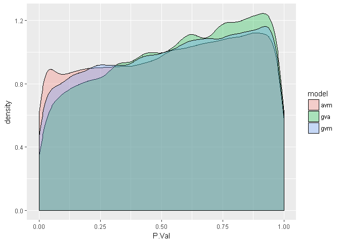
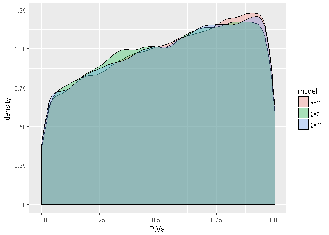
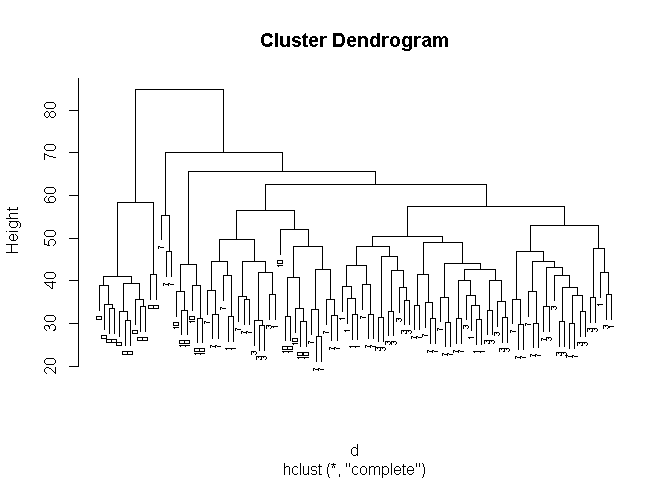
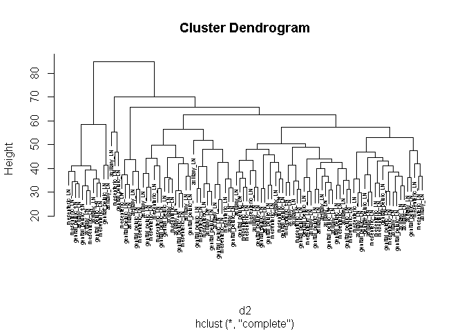
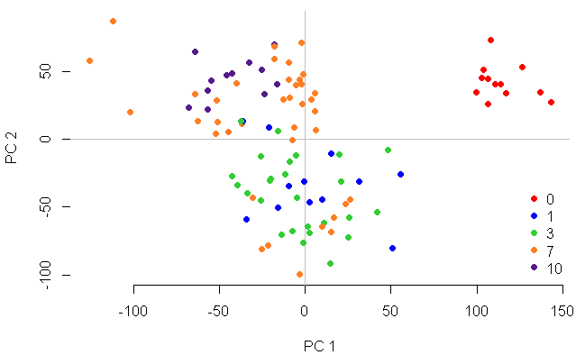
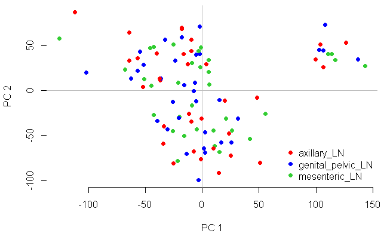

# Question 3: Do transcriptomic changes in lymph node tissues vary by lymph node location?

Using Limma, we want to fit linear models to observe differences in gene expression based on lymph node location to answer the question of whether or not there will be changes in gene expression depending on lymph node location.


# Load cleaned data and metadata from Data Cleaning Files

```r
## Load cleaned data and metadata
DATA <- read.table("../team_SIV-in-Rhesus-Monkeys/Data/Processed Data/DATA.txt", 
    header = TRUE, row.names = 1)
colnames(DATA) <- gsub("X", "", colnames(DATA))
MetaData <- read.table("../team_SIV-in-Rhesus-Monkeys/Data/Processed Data/MetaData_cleaned.txt", 
    header = TRUE, row.names = 1)
```

# Creating Contrast Matrices
First we create a design a contrast matrix to compare lymph node (LN) type. We set genital pelvic LN as baseline since the primary site of infection was in the vaginal tissue.

```r
des_M <- model.matrix(~0 + tissue + days, MetaData)  # We get the design matrix
contrast_LN1 <- makeContrasts(tissuegenital_pelvic_LN - tissueaxillary_LN, 
    levels = des_M)  # Set genital pelvic LN as baseline and contrast with axillary LN

contrast_LN2 <- makeContrasts(tissuegenital_pelvic_LN - tissuemesenteric_LN, 
    levels = des_M)  # Same as contrast_LN1 but comparing with mesenteric LN

contrast_LN3 <- makeContrasts(tissuemesenteric_LN - tissueaxillary_LN, 
    levels = des_M)  #compare between axillary LN and mesenteric LN

# Just to see expected output:
contrast_LN1
```

```
##                          Contrasts
## Levels                    tissuegenital_pelvic_LN - tissueaxillary_LN
##   tissueaxillary_LN                                                -1
##   tissueBlood                                                       0
##   tissueColon                                                       0
##   tissuegenital_pelvic_LN                                           1
##   tissueJejunum                                                     0
##   tissuemesenteric_LN                                               0
##   tissueTonsil                                                      0
##   days                                                              0
```

# Fit Linear Model
Next we fit our linear model and look at differentially expressed genes between genital pelvic LN in contrast to axillary LN:

```r
fitGvA_LN <- contrasts.fit(lmFit(DATA, des_M), contrast_LN1)
fit_toptableGvA_LN <- topTable(eBayes(fitGvA_LN), n = Inf)
head(fit_toptableGvA_LN)
```

```
##                  logFC   AveExpr         t      P.Value    adj.P.Val
## ILMN_2374904 2.8463543 10.475145 10.275117 1.614981e-20 7.594931e-16
## ILMN_2338921 1.3498055  7.770254  9.430761 5.597775e-18 1.316261e-13
## ILMN_2124187 1.7317026 10.122037  8.421908 4.583200e-15 7.184625e-11
## ILMN_1876837 1.6818002 10.207098  8.324693 8.583754e-15 1.009192e-10
## ILMN_1807136 1.6352146 10.397028  8.181235 2.152376e-14 2.024438e-10
## ILMN_1690576 0.8485148  7.248965  8.067924 4.423373e-14 3.467039e-10
##                     B
## ILMN_2374904 34.54446
## ILMN_2338921 29.16322
## ILMN_2124187 22.97906
## ILMN_1876837 22.40015
## ILMN_1807136 21.55195
## ILMN_1690576 20.88728
```

We do the same between genital pelvic LN and mesenteric LN:

```r
fitGvM_LN <- contrasts.fit(lmFit(DATA, des_M), contrast_LN2)
fit_toptableGvM_LN <- topTable(eBayes(fitGvM_LN), n = Inf)
head(fit_toptableGvM_LN)
```

```
##                   logFC  AveExpr          t      P.Value    adj.P.Val
## ILMN_1741334 -0.6081010 6.680046 -15.220869 2.494576e-36 1.173149e-31
## ILMN_1664009 -0.4966839 6.817722 -13.606900 4.400373e-31 1.034704e-26
## ILMN_1702760  0.8659608 6.765269  10.709708 7.442795e-22 1.166733e-17
## ILMN_1736311  1.2130767 8.650596   9.439923 5.259074e-18 6.183093e-14
## ILMN_3261387  0.8523190 7.739289   9.059859 6.855649e-17 6.448149e-13
## ILMN_1672382  1.7689987 8.669263   8.379387 6.033301e-15 4.728902e-11
##                     B
## ILMN_1741334 67.57577
## ILMN_1664009 56.69840
## ILMN_1702760 37.33823
## ILMN_1736311 29.19672
## ILMN_3261387 26.83305
## ILMN_1672382 22.70782
```

Just to check differences between axillary and mesenteric LN:

```r
fitAvM_LN <- contrasts.fit(lmFit(DATA, des_M), contrast_LN3)
fit_toptableAvM_LN <- topTable(eBayes(fitAvM_LN), n = Inf)
head(fit_toptableAvM_LN)
```

```
##                   logFC   AveExpr         t      P.Value    adj.P.Val
## ILMN_1741334  0.6805448  6.680046  17.16149 1.294919e-42 6.089746e-38
## ILMN_1664009  0.5156880  6.817722  14.23314 4.072524e-33 9.576133e-29
## ILMN_2374904  3.3472893 10.475145  12.08353 3.539546e-26 5.548592e-22
## ILMN_1736311 -1.3417868  8.650596 -10.51958 2.874685e-21 3.379767e-17
## ILMN_1901616 -1.0464467  7.238798 -10.32157 1.164590e-20 1.095367e-16
## ILMN_3261387 -0.9444838  7.739289 -10.11459 4.978843e-20 3.902417e-16
##                     B
## ILMN_1741334 80.70786
## ILMN_1664009 61.09803
## ILMN_2374904 46.55900
## ILMN_1736311 36.18621
## ILMN_1901616 34.89852
## ILMN_3261387 33.56049
```

# Hits for Differential Gene expression between Lymph Nodes 
Now we observe how many probes are differentially expressed between lymph nodes:

## 1. Between Genital-Pelvic and Axillary Lymph Nodes:

```r
# Filter based on p-value <= 0.001
Top_hitsGvA_LN <- fit_toptableGvA_LN %>% filter(P.Value <= 0.001)
nrow(Top_hitsGvA_LN)
```

```
## [1] 83
```

```r
# Filter based on p-value <= 0.05
Top_adjpGvA <- fit_toptableGvA_LN %>% filter(adj.P.Val <= 0.05)
nrow(Top_adjpGvA)
```

```
## [1] 37
```

## 2. Between genital-pelvic and mesenteric lymph nodes:

```r
# Filter based on p-value <= 0.001
Top_hitsGvM_LN <- fit_toptableGvM_LN %>% filter(P.Value <= 0.001)
nrow(Top_hitsGvM_LN)
```

```
## [1] 188
```

```r
# Filter based on adjusted p-value <= 0.05
Top_adjpGvM <- fit_toptableGvM_LN %>% filter(adj.P.Val <= 0.05)
nrow(Top_adjpGvM)
```

```
## [1] 100
```

## 3. Between axillary and mesenteric lymph nodes:

```r
# Filter based on p-value <= 0.001
Top_hitsAvM_LN <- fit_toptableAvM_LN %>% filter(P.Value <= 0.001)
nrow(Top_hitsAvM_LN)
```

```
## [1] 308
```

```r
# Filter based on adjusted p-value <= 0.05
Top_adjpAvM <- fit_toptableAvM_LN %>% filter(adj.P.Val <= 0.05)
nrow(Top_adjpAvM)
```

```
## [1] 194
```

# Check distribution of p-values for these models

```r
pval_gvm <- fit_toptableGvM_LN$P.Value
pval_gva <- fit_toptableGvA_LN$P.Value
pval_avm <- fit_toptableAvM_LN$P.Value
compareModel <- data.frame(model = rep(c("gvm", "gva", "avm"), 
    each = nrow(fit_toptableGvM_LN)), P.Val = c(pval_gvm, pval_gva, 
    pval_avm))
ggplot(compareModel, aes(x = P.Val, fill = model)) + geom_density(alpha = 0.3)
```

<!-- -->

Based on this plot, it seems like something may be wrong with the test. Perhaps the test assumes that the data fits some distribution does not fit. Perhaps this may be an error due to not including the interaction term of tissue*days.

Let's look at that next...

# Creating Contrast Matrices and include the days*tissue interaction
First we create a design a contrast matrix to compare lymph node (LN) type. We set genital pelvic LN as baseline since the primary site of infection was in the vaginal tissue.

```r
des_Mtd <- model.matrix(~0 + tissue + days + tissue * days, MetaData)  # We get the design matrix
colnames(des_Mtd) <- str_replace(colnames(des_Mtd), ":", "_")
contrast.ga <- makeContrasts(tissuegenital_pelvic_LN - tissueaxillary_LN, 
    levels = des_Mtd)  # Set genital pelvic LN as baseline and contrast with axillary LN

contrast.gm <- makeContrasts(tissuegenital_pelvic_LN - tissuemesenteric_LN, 
    levels = des_Mtd)  # Same as contrast_LN1 but comparing with mesenteric LN

contrast.am <- makeContrasts(tissuemesenteric_LN - tissueaxillary_LN, 
    levels = des_Mtd)  #compare between axillary LN and mesenteric LN

# Just to see expected output:
contrast.ga
```

```
##                               Contrasts
## Levels                         tissuegenital_pelvic_LN - tissueaxillary_LN
##   tissueaxillary_LN                                                     -1
##   tissueBlood                                                            0
##   tissueColon                                                            0
##   tissuegenital_pelvic_LN                                                1
##   tissueJejunum                                                          0
##   tissuemesenteric_LN                                                    0
##   tissueTonsil                                                           0
##   days                                                                   0
##   tissueBlood_days                                                       0
##   tissueColon_days                                                       0
##   tissuegenital_pelvic_LN_days                                           0
##   tissueJejunum_days                                                     0
##   tissuemesenteric_LN_days                                               0
##   tissueTonsil_days                                                      0
```

# Fit Linear Model with the interaction term
Next we fit our linear model and look at differentially expressed genes between genital pelvic LN in contrast to axillary LN:

```r
fitGvA_LN.td <- contrasts.fit(lmFit(DATA, des_Mtd), contrast.ga)
fit_toptableGvA_LN.td <- topTable(eBayes(fitGvA_LN.td), n = Inf)
fit_toptableGvA_LN.td$probe.id <- rownames(fit_toptableGvA_LN.td)
head(fit_toptableGvA_LN.td)
```

```
##                 logFC   AveExpr        t      P.Value    adj.P.Val
## ILMN_2338921 1.698366  7.770254 6.937387 4.552234e-11 2.140825e-06
## ILMN_2124187 2.196017 10.122037 6.447779 7.282016e-10 1.712293e-05
## ILMN_1876837 2.113280 10.207098 6.315296 1.508321e-09 1.825442e-05
## ILMN_1807136 2.094386 10.397028 6.309990 1.552642e-09 1.825442e-05
## ILMN_3275267 1.940428 10.201043 6.231130 2.383430e-09 2.241759e-05
## ILMN_1795021 1.703895  9.265060 5.531563 9.105762e-08 7.137096e-04
##                      B     probe.id
## ILMN_2338921 12.710085 ILMN_2338921
## ILMN_2124187 10.463207 ILMN_2124187
## ILMN_1876837  9.872588 ILMN_1876837
## ILMN_1807136  9.849096 ILMN_1807136
## ILMN_3275267  9.501414 ILMN_3275267
## ILMN_1795021  6.546003 ILMN_1795021
```

Fit the linear models between genital pelvic LN and mesenteric LN:

```r
fitGvM_LN.td <- contrasts.fit(lmFit(DATA, des_Mtd), contrast.gm)
fit_toptableGvM_LN.td <- topTable(eBayes(fitGvM_LN.td), n = Inf)
fit_toptableGvM_LN.td$probe.id <- rownames(fit_toptableGvM_LN.td)
head(fit_toptableGvM_LN.td)
```

```
##                   logFC  AveExpr          t      P.Value    adj.P.Val
## ILMN_1741334 -0.6990692 6.680046 -10.068391 8.346837e-20 3.925351e-15
## ILMN_1664009 -0.5702440 6.817722  -8.788811 4.717837e-16 1.109352e-11
## ILMN_1721601 -0.3967099 6.748510  -5.497636 1.078337e-07 1.575264e-03
## ILMN_1736311  1.2269619 8.650596   5.453856 1.339852e-07 1.575264e-03
## ILMN_3261387  0.8590883 7.739289   5.165712 5.424529e-07 5.102095e-03
## ILMN_1718539 -0.5065098 7.404108  -5.102667 7.312966e-07 5.731903e-03
##                      B     probe.id
## ILMN_1741334 28.754144 ILMN_1741334
## ILMN_1664009 21.902035 ILMN_1664009
## ILMN_1721601  6.391096 ILMN_1721601
## ILMN_1736311  6.215401 ILMN_1736311
## ILMN_3261387  5.084609 ILMN_3261387
## ILMN_1718539  4.843247 ILMN_1718539
```

Between axillary and mesenteric LNs:

```r
fitAvM_LN.td <- contrasts.fit(lmFit(DATA, des_Mtd), contrast.am)
fit_toptableAvM_LN.td <- topTable(eBayes(fitAvM_LN.td), n = Inf)
fit_toptableAvM_LN.td$probe.id <- rownames(fit_toptableAvM_LN.td)
head(fit_toptableAvM_LN.td)
```

```
##                   logFC   AveExpr         t      P.Value    adj.P.Val
## ILMN_1741334  0.8359790  6.680046 12.040277 6.765734e-26 3.181790e-21
## ILMN_1664009  0.6303691  6.817722  9.715509 9.462269e-19 2.224958e-14
## ILMN_1736311 -1.6301972  8.650596 -7.246260 7.440471e-12 1.166368e-07
## ILMN_3261387 -1.1554310  7.739289 -6.947645 4.289695e-11 5.043395e-07
## ILMN_1714159  0.3299091  6.587834  6.678647 2.001198e-10 1.882247e-06
## ILMN_2374904  2.7120482 10.475145  5.821270 2.087196e-08 1.635944e-04
##                      B     probe.id
## ILMN_1741334 39.705152 ILMN_1741334
## ILMN_1664009 26.861810 ILMN_1664009
## ILMN_1736311 14.154790 ILMN_1736311
## ILMN_3261387 12.738998 ILMN_3261387
## ILMN_1714159 11.492906 ILMN_1714159
## ILMN_2374904  7.728202 ILMN_2374904
```


# Hits for Differential Gene expression between Lymph Nodes with Interaction Term added
Now we observe how many probes are differentially expressed between lymph nodes:

## 1. Between Genital-Pelvic and Axillary Lymph Nodes:

```r
# Filter based on p-value <= 0.001
Top_hitsGvA_LN.td <- fit_toptableGvA_LN.td %>% filter(P.Value <= 
    0.001)
nrow(Top_hitsGvA_LN.td)
```

```
## [1] 55
```
55 differentially expressed genes between genital-pelvic and axillary lymph nodes at p-value <= 1e-3


```r
# Filter based on fdr <= 0.05
Top_adjpGvA.td <- fit_toptableGvA_LN.td %>% filter(adj.P.Val <= 
    0.05)
nrow(Top_adjpGvA.td)
```

```
## [1] 11
```
11 differentially expressed genes between genital-pelvic and axillary lymph nodes at fdr <= 0.05

## 2. Between genital-pelvic and mesenteric lymph nodes:

```r
# Filter based on p-value <= 0.001
Top_hitsGvM_LN.td <- fit_toptableGvM_LN.td %>% filter(P.Value <= 
    0.001)
nrow(Top_hitsGvM_LN.td)
```

```
## [1] 55
```
55 differentially expressed genes between genital-pelvic and mesenteric lymph nodes at p-value <= 1e-3


```r
# Filter based on fdr <= 0.05
Top_adjpGvM.td <- fit_toptableGvM_LN.td %>% filter(adj.P.Val <= 
    0.05)
nrow(Top_adjpGvM.td)
```

```
## [1] 13
```
13 differentially expressed genes between genital-pelvic and mesenteric lymph nodes at fdr <= 0.05

## 3. Between axillary and mesenteric lymph nodes:

```r
# Filter based on p-value <= 0.001
Top_hitsAvM_LN.td <- fit_toptableAvM_LN.td %>% filter(P.Value <= 
    0.001)
nrow(Top_hitsAvM_LN.td)
```

```
## [1] 69
```
69 DE genes between axillary and mesenteric lymph nodes at p-value <= 1e-3


```r
# Filter based on adjusted fdr <= 0.05
Top_adjpAvM.td <- fit_toptableAvM_LN.td %>% filter(adj.P.Val <= 
    0.05)
nrow(Top_adjpAvM.td)
```

```
## [1] 28
```
28 DE genes between axillary and mesenteric lymph nodes at fdr <= 0.05


```r
pval_gvmtd <- fit_toptableGvM_LN.td$P.Value
pval_gvatd <- fit_toptableGvA_LN.td$P.Value
pval_avmtd <- fit_toptableAvM_LN.td$P.Value
compareModel <- data.frame(model = rep(c("gvm", "gva", "avm"), 
    each = nrow(fit_toptableGvM_LN.td)), P.Val = c(pval_gvmtd, 
    pval_gvatd, pval_avmtd))
ggplot(compareModel, aes(x = P.Val, fill = model)) + geom_density(alpha = 0.3)
```

<!-- -->

It seems likely that the test does not fit our data well enough. Let's see if there are differences between the lymph nodes at all.

# Unsupervised Hierarchical Clustering
To determine whether there are difference in the transcriptomic changes between the lymph nodes, we will perform unsupervised hierarchical clustering. We decided to use euclidean distance measure and complete linkage clustering to achieve balanced dendrograms.


```r
# subset meta data and data including only the samples that
# come from a lymph node
MetaLN <- MetaData[MetaData$tissue == "axillary_LN" | MetaData$tissue == 
    "mesenteric_LN" | MetaData$tissue == "genital_pelvic_LN", 
    ]

LN.samples <- rownames(MetaLN)
LN <- DATA[, LN.samples]


# clustering with days as names
colnames(LN) <- MetaLN$days
d <- dist(as.matrix(t(LN)), method = "euclidean")  # find distance matrix 
hc <- hclust(d, method = "complete")  # apply hierarchical clustering 
plot(hc, cex = 0.5)
```

<!-- -->

```r
# clustering with tissues as names
colnames(LN) <- MetaLN$tissue
d2 <- dist(as.matrix(t(LN)), method = "euclidean")
hc2 <- hclust(d2, method = "complete")
plot(hc2, cex = 0.5)
```

<!-- -->

The two plots are depicting the same clustering. In the first plot, the samples are annotated by their time point. We can see that the "day 0" samples cluster separatly from the samples from the other days. The "day 0" samples are from uninfected control so it is not unsurprising that these samples are less similar to the other ones. Interestingly, there is no clustering by lymph lode location, indicating that the transcriptomic changes between the lymph nodes are not significantly different.

# PCA 
For better visiual representation, we will also perform principal component analysis:

```r
# calculate PCA
pcaLN <- prcomp(t(LN), scale. = TRUE)
# print PCA with labels=days
pca2d(pcaLN, radius = 1, group = MetaLN$days, shape = "sphere", 
    palette = c("red", "blue", "limegreen", "chocolate1", "purple4"), 
    legend = "bottomright")
```

<!-- -->

```r
# print PCA with labels=lymph node type
pca2d(pcaLN, radius = 1, group = MetaLN$tissue, shape = "sphere", 
    palette = c("red", "blue", "limegreen"), legend = "bottomright")
```

<!-- -->

The results are (as expected) the same as those obtained by unsupervised hierarchical clustering. In conclusion, we infer that the location of the lymph node and hence the distance from infection site does not have a significant impact on transcriptomic changes in the first 10 days after SIV infection. This suggests rapid viral dissemination throughout the entire host and/or rapid migration of immune cells that have encountered SIV antigens.
